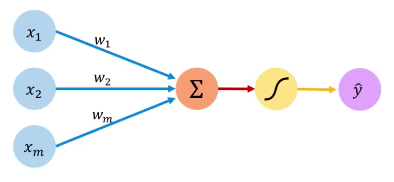

# Artificial Neural Networks

An AI can be seen as a machine (or in mathematical terms, a *function*) that takes some input and transforms it into some output.
In the case of an LLM, the input is the question you ask it, and the output is its answer.
For a chess game, the input would be the state of the board, and the output would be its next move.

However, we do not want to build this AI-machine manually.
Instead, we just want to define the parts that can go inside of it, and let it sort out itself how to arrange those parts.
Put differently, we want it to learn on its own.

In order for the AI to be able to learn, we need to somehow *train* it.
For games this is typically very easy: we can simply let the AI play millions of games against itself.
For other applications, such as recognizing tumors based on x-rays, detecting tanks based on aerial pictures, etc. a large of pre-classified data is necessary.

Let's assume we have the necessary data to perform all necessary training: we have plenty of inputs and corresponding desired outputs.
That leaves us with the AI machine itself.
Out of which pieces will we build it?

A first attempt could be to see the AI as a set of rules written in, say, English, to keep things simple.
The building blocks would be words, and if placed together correctly, we would be able to describe any set of rules to follow that would make a good AI.
For a decent AI, the set of rules could grow very large, but we don't really worry about that.

As an example, let's pretend we are building a chess AI.
We can start off with two very simple AIs, e.g.,

* "Use the queen to capture the strongest possible piece, or, if impossible, make a valid random move."
* "Always advance a pawn, and capture if you can. If no such move is possible, make a valid random move."

We can pit these two AIs against each other and see which one performs best.
We only keep the winner around and slightly change (a mutation if you wish) its rule set by adding some random words.
Again we hold a number of games to determine who wins, and so on.

There is a big problem though.
Updating the rule set should be kept very simple, and our approach consists of adding or removing random words.
However, it is all too easy to end up with nonsensical rules.
For example, `"Use the queen to capture the elephant possible piece, or, if impossible, make a valid random move."`
only differs in one word, but it has lost all meaning (remember, a machine takes instructions very literally).
The problem is that if we consider all possible sentences built out of random English words, very few of them actually have any meaning.
In other words, most of our newly generated rule sets would be useless, causing the whole training to become very inefficient.

It is possible (quite easy even) to define a language that, contrary to English, always assign some useful meaning to whatever "text" we write in it.
So instead of using English, we use such a language to describe our rule sets in.
Our search for the perfect rule set therefore becomes much more efficient, as we don't have to deal with the possibility of invalid rule sets anymore.

There is another potential problem: depending on the language used to describe the rules, it is possible that a single word change can dramatically change the meaning of a rule set.
Ideally, small changes in the words should cause small changes in described behavior.
If this is not the case, our attempts at gradually improving the AI can become very chaotic.
In our search for the perfect AI, we should be able to gradually improve it, using small steps.

Artificial neural networks (ANNs) offer a representation for rule sets that features these qualities.
There is only one building block: the neuron.
A neuron receives a fixed numbers of inputs (numeric values), each of which it assigns a certain importance to, known as the input's *weight*.
It adds up all these inputs, and based on the result, the neuron decides which number to output.

A neural network consists of many such neurons, linked to one another: one neuron's output can be used as other neurons' input.
Typically, neurons are arranged in layers, where all the outputs of one layer are used as inputs for each neuron on the next layer.

When "asking a question" to the neural network (e.g., "which move would be best for white on this chess board?"), the input (the chess board) must be encoded as numerical values, which are then fed to the first (leftmost) layer of neurons.
These process the data and produce a new set of values, which are then fed to the neurons in the second layer, and so on.
Finally, after the last layer has generated value, this output must be translated into valid answer (e.g., "rook to c4").

To make use of an artificial neural network, we must first decide on its general structure: how many layers with how many neurons in each will it contain?
Next, we need to determine the weights, i.e., one number for each link between neurons.
We start off with random weights, after which training can take over: by tweaking the weights in the right way, we can achieve the desired outcomes.

This tweaking can happen randomly, by increasing or decreasing weights and then checking whether the neural network has improved, and tweaking in a different way if it did not.
However, neural networks allow for a more efficient approach.
An added benefit of using neural networks is that their mathematical nature allows us to perform directed updates instead of resorting to random trial-and-error:
we can measure how wrong the network's outputs are, and based on that, we can determine how the weights should be adapted.

While it may seem surprising that anything special can be achieved by what are essentially just a bunch of additions, multiplications and comparisons,
it has been proven that [a neural network can approximate any continuous function to an arbitrary degree](https://en.wikipedia.org/wiki/Universal_approximation_theorem).
In simplified terms, one could say that as soon as it is possible to have an AI for a specific problem, that artificial networks will be able to handle it, as long
as one makes it sufficiently large.
So, the question is not whether or not an ANN can handle the problem, but merely whether it is the most efficient method.

## Question

A neuron computes the weighted sum of its inputs, after which it decides which output to generate.
What is this part of the neuron called?