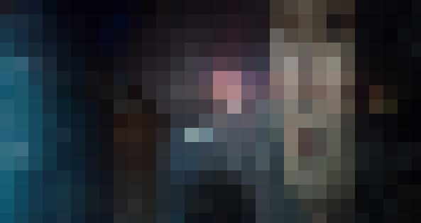
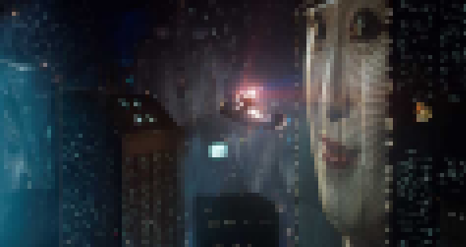

# Images

Now that we know how colors are digitized, we can start building images with them.
Say we have an image, how do we convert it into bits?

We take our image and overlay it with a `W`&times;`H` grid, where `W` and `H` can be freely chosen.
For each square (*pixel*) in this grid, we must pick a *single* color.
Typically, a square will cover a part of the image where multiple different colors appear, so we need a way to decide which single color would give the best results.
We won't delve into those technical details.

Consider this image:

If we put a grid over this image of 30x16 pixels, we get

We can see that some detail appears to have been lost during the digitization process.
Luckily we can increment the number of pixels, which will lead to a sharper result:

or, still better:

The number of squares in the grid is called the *resolution*.
The higher the resolution, the smaller the pixels, the better the image quality.

So, given a resolution of `W` by `H` pixels, we have `W`&times;`H` pixels (colors) to store per image.
How much a single pixel takes was discussed in a previous challenge.

## Question

Find out what the size in pixels is of the original image.
Write the answer as `W H`, for example `300 100`.
