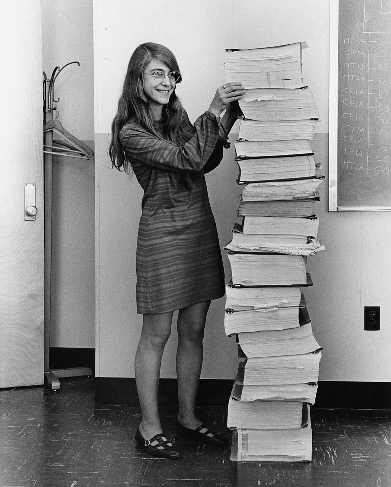

# Image Search

This person was literally responsible for the success of a moonshot, the actual landing of the moon, as she wrote all the software responsible for it (the stack of paper next to her is a print-out).
However, during the landing, a problem occurred when a too large amount of tasks (programs) was run on the (old) hardware.

## Question

What was the maximum amount of tasks supported on the hardware?
