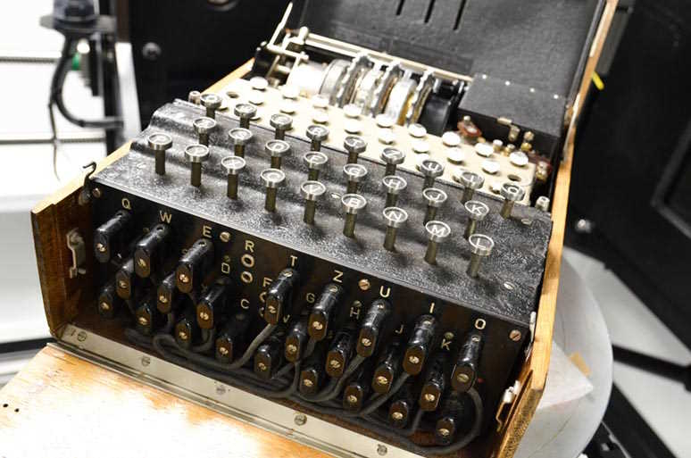

# Image Search

This machine was used by the Germans during World War 2 to encrypt their communication.

Knowing your enemy's intentions is crucial in a war, so the Allies invested a lot of resources in finding ways for cracking the coded messages.
This was not an easy task: every day, the Germans would initialize the machine with a different key, which could take on many values (158,962,555,217,826,360,000 to be exact).
So, every day, the allies had to start over and find the right key: none of the cracking achievements could be carried over to the next day.

To beat the Germans' machine, the Allies (among which Alan Turing) developed a computer specialized in finding the key.
In order to help reduce the search space (i.e., the number of possible keys to be considered), all kinds of clever trickery had to be employed.

One important flaw of the German encryption is that the n-th letter in the ciphertext (= the encrypted message) depends only on the n-th letter in the plaintext (= the actual readable message).
For example, say `ABCD` gets encrypted to `SFAP`.
If we change the third letter in the plaintext (`ABXD`), then only the corresponding letter will change in the ciphertext (`SF?P`).
This is different from modern encryptions, where one changed bit in the plaintext can cause any bits in the corresponding ciphertext to change.

This weakness could be exploited by the Allies, especially with the help of the Germans who exacerbated the flaw by making some extra mistakes:

* The Germans would start each message with three letters repeated, e.g., `AJFAJF`.
* The Germans would also have many standard messages, such as "nothing to report" or "weather forecast".
* The Allies would sometimes trick the Germans into sending specific messages,
  such as performing an attack and then waiting for the report about it.

This way, the Allies would have both the ciphertext and (parts of) the plaintext, which simplifies cracking the code dramatically.

The Allies could not always afford acting on decrypted messages and had to deliberately undergo German attacks at times, lest
the Germans grow suspicious and upgrade their encoding machine.

## Question

What was the name of this encrypting contraption?
