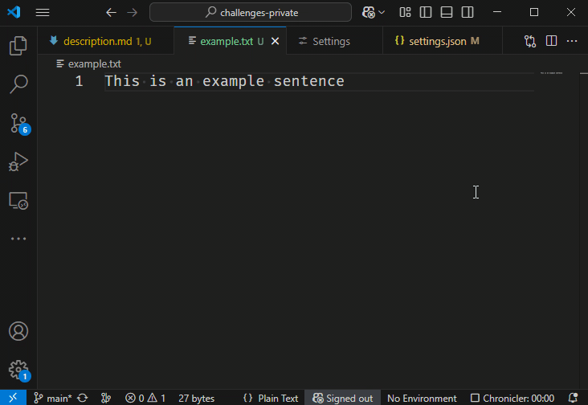

# Selecting

Visual Studio Code (not to be confused with Visual Studio, which is a much bigger beast) is a very popular editor:

* It is free.
* It is available on Windows, macOS and Linux.
* It allows extensions to be installed, of which there are many available:
  regardless of whether you're coding in Python, Java, HTML or C++, VSCode will have your back.
* It's lightweight (at least compared to full blown IDEs)

It can be useful to spend some time learning the text editing features of VSCode,
more specifically, how to use keyboard shortcuts.

In this series of challenges, we'll ask you to find out how to perform some common operations.

## Question

Let's start simple: using which key combination can we select a range of characters as shown below?

Here are a few examples of what the answer could look like:

* `CTRL+F`
* `ALT+F4`
* `⌘K` (for macOS users)
* `⌥⌘[` (for macOS users)
