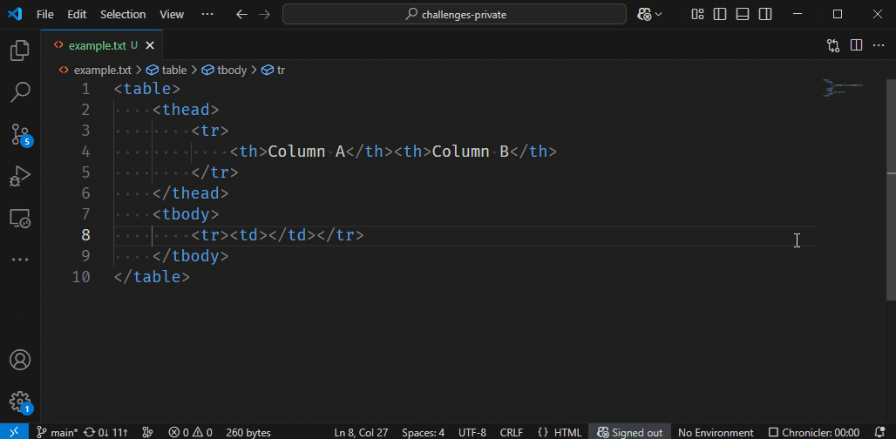

# Copying Line

What is the shortcut to copy the current line?
The copy should be placed below the current line and the cursor should follow it downwards, as shown below:

Note: on Linux there does not seem to be a default keybinding for this operation.
