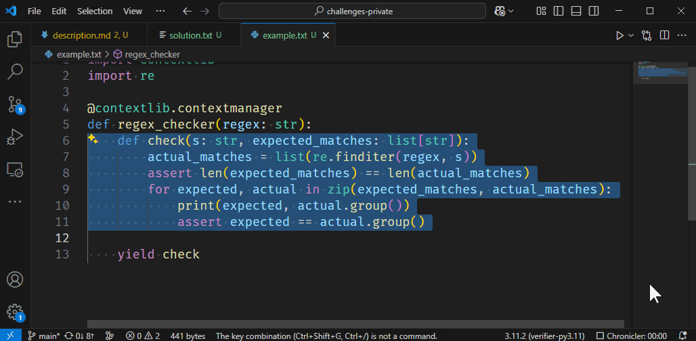

# Commenting

When you're coding, it can be quite useful to deactivate some parts by putting them in comments.

Which keyboard shortcut puts selected lines in comments, but if they are already are, uncomments them back again?
In the demo shown above, the same keybinding is pressed multiple times.
