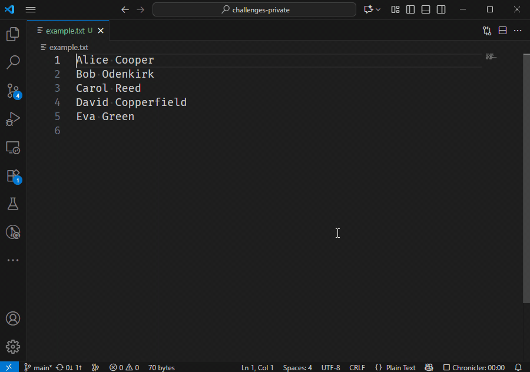
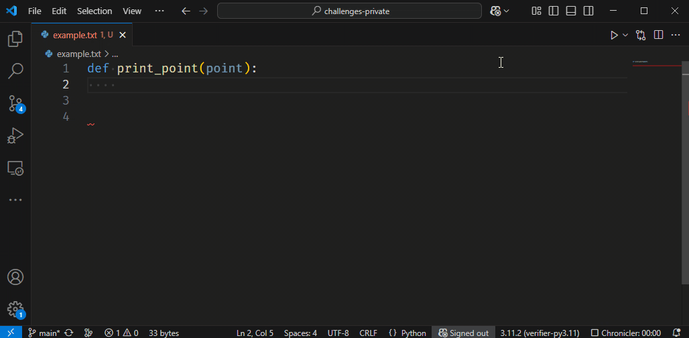

# Multiple Cursors

You can have multiple cursors at once.
All your actions will be repeated for each cursor.

What shortcut can you use to add a new cursor on the line below the current one?

## Extra: Clipboard

Note that each cursor has its own clipboard, as shown below:

* We first type `x`, `y` and `z` on different lines.
* We place a cursor at the beginning of each line.
* We select the character and place it on the keyboard.
* We begin typing, and as you can see, the same text appears in duplicate.
* When pasting, each cursor will paste what's currently on its own clipboard.
