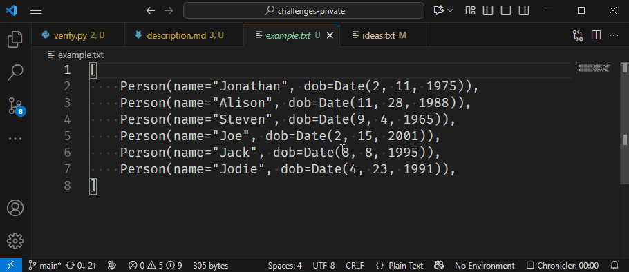

# Multiple Cursors 2

Multiple cursors can be very useful.
In the previous challenge, you saw how to add cursors one below the other.
You can also add cursors add places that match the current selection.

Say you define multiple dates, but you've got the order wrong: you wrote `month, day, year` instead of `day, month, year`.
Every instance of `Date(x, y, z)` needs to be changed to `Date(y, x, z)`.
This can be achieved as follows:

* Select `Date`.
* Use the special shortcut to put cursors at other occurrences of `Date`.
* Move the cursor to the first argument (which represents the month) and cut it too the clipboard.
* Move the cursor to the correct location and paste it from the clipboard.

Which keyboard shortcut did we use to add cursors at extra occurrences of the current selection?
