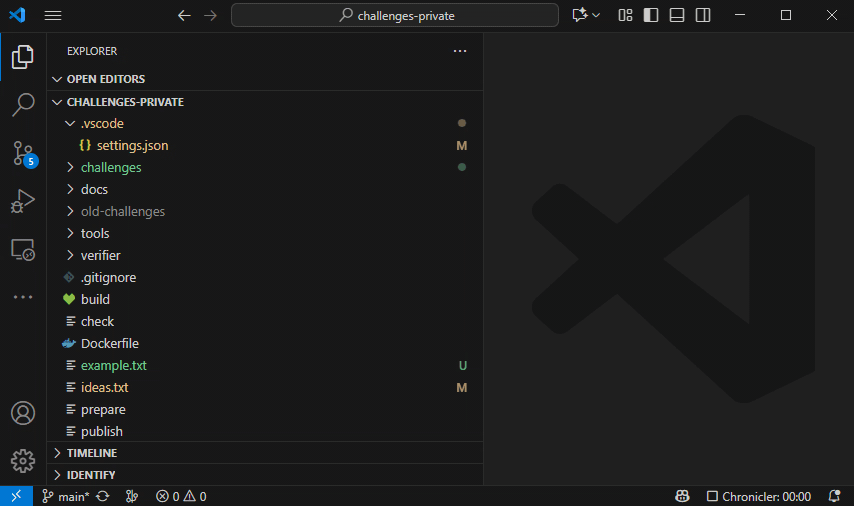

# Search Files

A software project often consists of many files spread over a directory structure.
With VSCode, it would be inefficient to open these files one at a time as needed.
Instead, you ask VSCode to open the root of the directory structure.
VSCode will then show a hierarchical view of all files and directories located under that root
and it becomes much easier to open and edit files.

Say you want to search for a specific piece of text across your entire project, i.e.,
have VSCode open each file in turn, look for all occurrences, and present them all in a list.
Which keyboard shortcut should you use?

