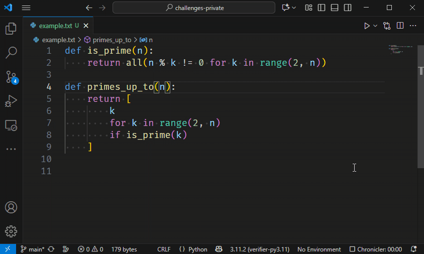

# Renaming

While coding, you constantly have to *name* things: functions, variables, classes, ... all need names.
Sometimes, a name turns out to be ill-chosen and needs an update.
However, a simple search-and-replace will not do:

* Sometimes you need to rename a short name such as `n`, and you don't want *all* `n`s in your file to be replaced.
* The same name can be used in multiple places, but you only want to update those occurrences that refer to the same thing.

For example, consider the code below:

```python
def is_prime(n):
    return all(n % k != 0 for k in range(2, n))

def primes_up_to(n):
    return [
        k
        for k in range(2, n)
        if is_prime(k)
    ]
```

Both `is_prime` and `primes_up_to` have named their parameter `n`, but those are actually completely unrelated variables that happen to have the same name.

Say we want to rename the parameter `n` of `primes_up_to` to `upper_bound`, but leave the unrelated parameter `n` from `is_prime` alone.
We need a smart search and replace mechanism that is able to tell the difference between the two `n`s.



Notice in the demo how only the right instances of `n` are being replaced.

Which keyboard shortcut did we use?
Note that this only works if you have the relevant extension installed, because knowing what to replace requires programming language specific knowledge.
